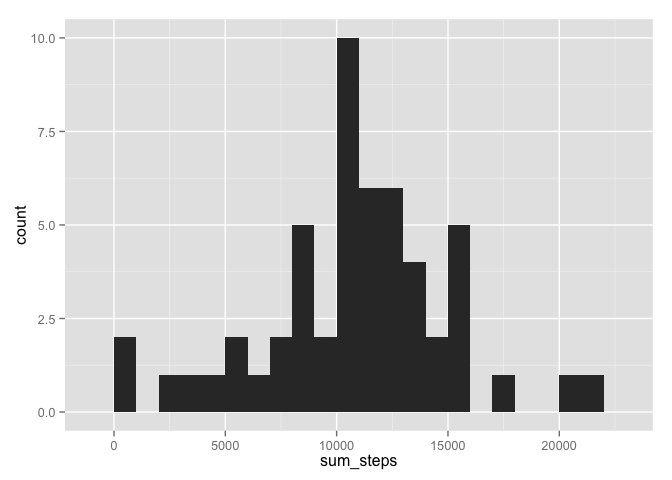
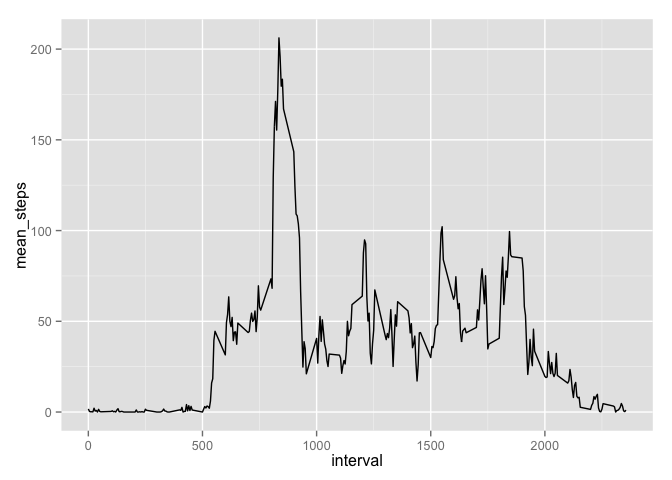
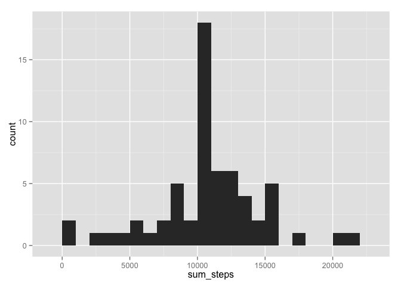
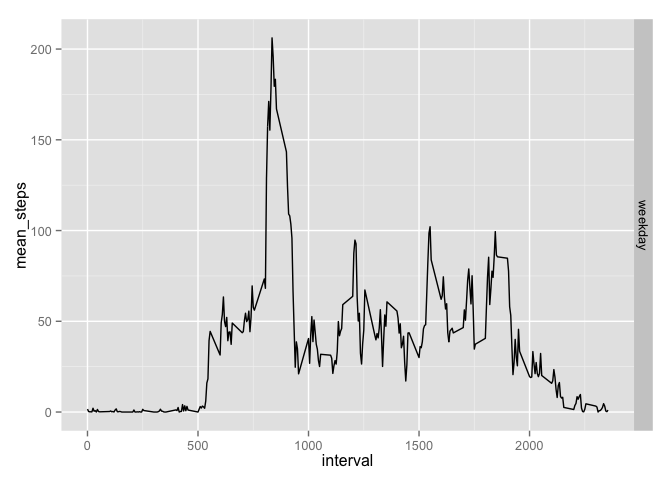

# Reproducible Research: Peer Assessment 1
**Reproducible Research** on *Coursera* (from *Johns Hopkins University*)

**Peer Assessment 1** *by DopedCow*

## Relevant Libraries and General Options
First we load relevant libraries and suppress scientific notation:

```r
# Load relevant libraries
library(ggplot2)
library(lubridate)
library(dplyr)
# Suppress scientific notation
options(scipen=999)
```

## Loading and preprocessing the data
Show any code that is needed to:

1. Load the data (i.e. read.csv())

```r
# We work under the assumption the correct WD has been set
raw <- read.csv('activity.csv', stringsAsFactors = FALSE)
```

2. Process/transform the data (if necessary) into a format suitable for your analysis

```r
activities <- tbl_df(raw) %>%   #convert to dplyr data frame
    filter(!is.na(steps)) %>%   #remove NA values
    group_by(date)
```

## What is mean total number of steps taken per day?
For this part of the assignment, you can ignore the missing values in the dataset.

1. Calculate the total number of steps taken per day

```r
total_steps_daily <- summarise(activities, sum_steps = sum(steps))
```

2. If you do not understand the difference between a histogram and a barplot, research the difference between them. Make a histogram of the total number of steps taken each day

```r
qplot(sum_steps, data = total_steps_daily, binwidth = 1000)
```

 

3. Calculate and report the mean and median of the total number of steps taken per day

```r
mean_steps <- as.integer(mean(total_steps_daily$sum_steps))
median_steps <- median(total_steps_daily$sum_steps)
```
The mean number of steps taken daily is **10766** and the median is **10765**.

## What is the average daily activity pattern?
1. Make a time series plot (i.e. type = "l") of the 5-minute interval (x-axis) and the average number of steps taken, averaged across all days (y-axis)

```r
activities <- tbl_df(raw) %>%   # convert to dplyr data frame
    filter(!is.na(steps)) %>%   # remove NA values
    group_by(interval)
total_steps_interval <- summarise(activities, mean_steps = mean(steps))
qplot(interval, mean_steps, data = total_steps_interval, geom = "line")
```

 

2. Which 5-minute interval, on average across all the days in the dataset, contains the maximum number of steps?

```r
max_steps <- max(total_steps_interval$mean_steps)
max_steps_interval <- which.max(total_steps_interval$mean_steps)
max_interval <- total_steps_interval[max_steps_interval,]$interval
```
The interval **835** has the highest number of average steps (**206.1698113**)

## Imputing missing values
Note that there are a number of days/intervals where there are missing values (coded as NA). The presence of missing days may introduce bias into some calculations or summaries of the data.

1. Calculate and report the total number of missing values in the dataset (i.e. the total number of rows with NAs)

```r
# Look for numbers of rows with NA values in raw data set
sum(is.na(raw))
```

```
## [1] 2304
```

2. Devise a strategy for filling in all of the missing values in the dataset. The strategy does not need to be sophisticated. For example, you could use the mean/median for that day, or the mean for that 5-minute interval, etc.

For this part the NA values will be replaced by the average across all days for the relevant interval. So if there is a NA value in interval number 1, the NA value will be replaced by the average value for all other non-NA interval 1's.

3. Create a new dataset that is equal to the original dataset but with the missing data filled in.

```r
# create new 'raw' data set
new_raw <- raw %>%
  mutate(steps = as.numeric(steps)) %>%
  group_by(interval) %>%
  mutate(steps = ifelse(is.na(steps), mean(steps, na.rm = TRUE), steps)) %>%
  mutate(steps = as.integer(steps))
head(new_raw) # show header of new 'raw data set
```

```
## Source: local data frame [6 x 3]
## Groups: interval [6]
## 
##   steps       date interval
##   (int)      (chr)    (int)
## 1     1 2012-10-01        0
## 2     0 2012-10-01        5
## 3     0 2012-10-01       10
## 4     0 2012-10-01       15
## 5     0 2012-10-01       20
## 6     2 2012-10-01       25
```

4. Make a histogram of the total number of steps taken each day and Calculate and report the mean and median total number of steps taken per day. Do these values differ from the estimates from the first part of the assignment? What is the impact of imputing missing data on the estimates of the total daily number of steps?


```r
# Repeating the code from first section but using the new 'raw' data set.
activities <- tbl_df(new_raw) %>%   #convert to dplyr data frame
    filter(!is.na(steps)) %>%   #remove NA values
    group_by(date)
total_steps_daily <- summarise(activities, sum_steps = sum(steps))
qplot(sum_steps, data = total_steps_daily, binwidth = 1000)
```

 

```r
mean_steps <- as.integer(mean(total_steps_daily$sum_steps))
median_steps <- median(total_steps_daily$sum_steps)
```
The new mean number of steps taken daily is **10749** and the new median is **10641**. This differs from the original numbers as both the mean and the median are lower than before. So the imputation has changed the calculations. To understand exactly how and why, further analysis beyond this one is needed. But since both numbers are smaller this is an indication that the NA values were primarily in the early intervals of the day.

## Are there differences in activity patterns between weekdays and weekends?
For this part the weekdays() function may be of some help here. Use the dataset with the filled-in missing values for this part.

1. Create a new factor variable in the dataset with two levels – “weekday” and “weekend” indicating whether a given date is a weekday or weekend day.

```r
weekend <- tbl_df(new_raw) %>%   #convert to dplyr data frame
    filter(!is.na(steps)) %>%   #remove NA values
    mutate(day_type = ifelse(weekdays(as.Date(date)) == 'saturday', 'weekend',
                             ifelse(weekdays(as.Date(date)) == 'sunday', 'weekend',
                                    'weekday'))) %>%
    group_by(interval, day_type) %>%
    summarise(mean_steps = mean(steps))
print(weekend)
```

```
## Source: local data frame [288 x 3]
## Groups: interval [?]
## 
##    interval day_type mean_steps
##       (int)    (chr)      (dbl)
## 1         0  weekday 1.62295082
## 2         5  weekday 0.29508197
## 3        10  weekday 0.11475410
## 4        15  weekday 0.13114754
## 5        20  weekday 0.06557377
## 6        25  weekday 2.08196721
## 7        30  weekday 0.45901639
## 8        35  weekday 0.75409836
## 9        40  weekday 0.00000000
## 10       45  weekday 1.40983607
## ..      ...      ...        ...
```

2. Make a panel plot containing a time series plot (i.e. type = "l") of the 5-minute interval (x-axis) and the average number of steps taken, averaged across all weekday days or weekend days (y-axis). See the README file in the GitHub repository to see an example of what this plot should look like using simulated data.

```r
qplot(interval, mean_steps, data = weekend, geom = "line", facets = day_type~.)
```

 
